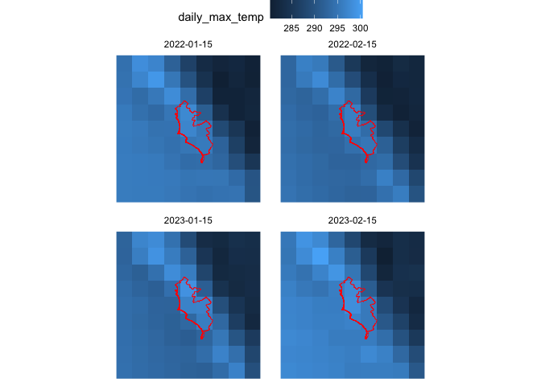
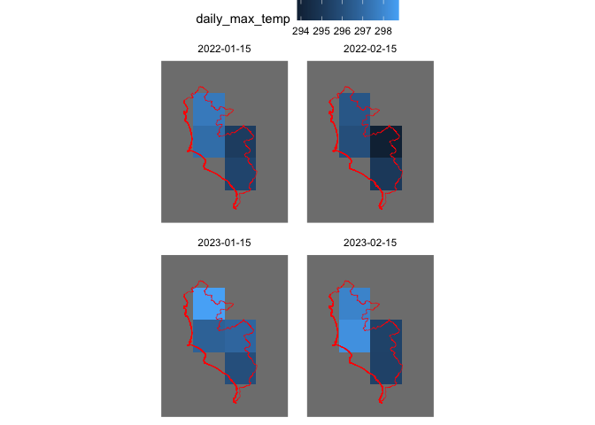
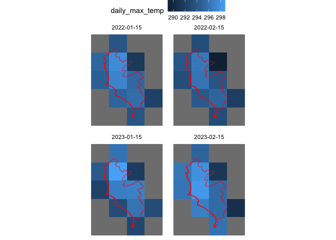
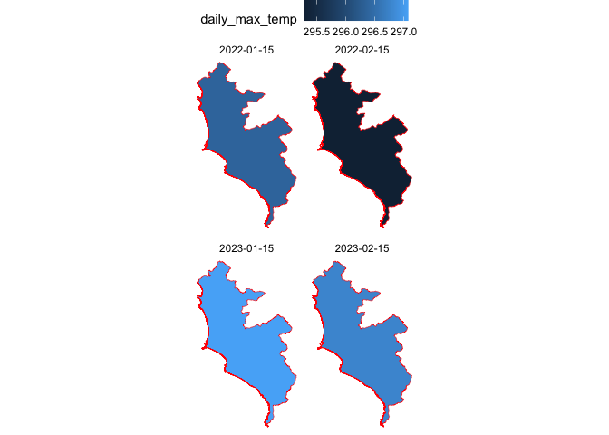
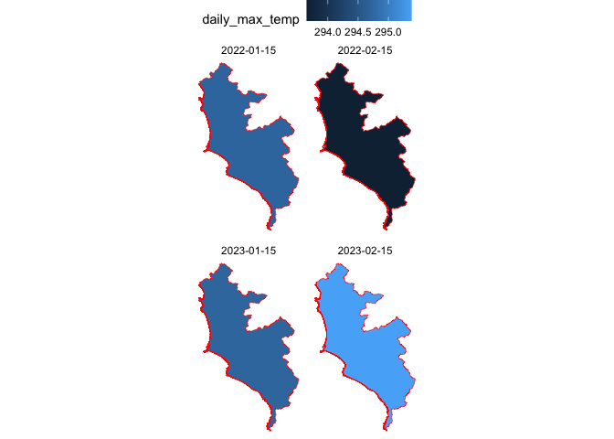
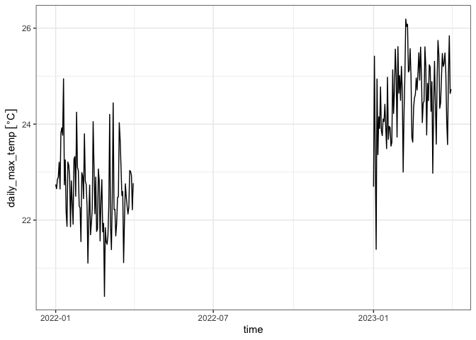
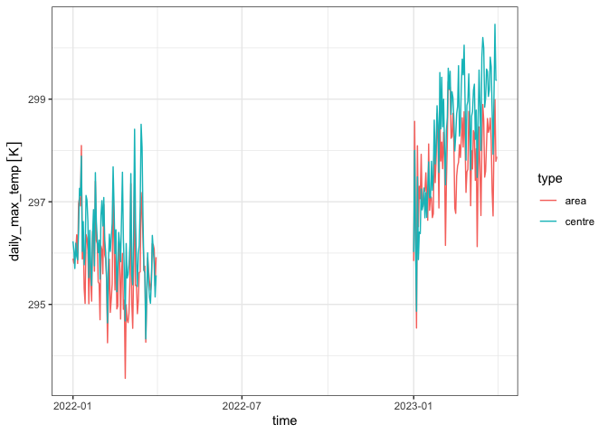

# stars demo

This is a short note to go over some common `stars` operations, given
that I am more familiar with `raster` and `terra`.

The set-up info is in the code chunks below. I am downloading only a
sample of the ERA5 Land images, for a couple of months and years, but
doing an aggregation on the server side before reading the images into
my computer. For more on that logic, see
[`emcwfr-example.R`](emcwfr-example.R).

<details>
<summary>Libraries and paths</summary>

``` r
library(tidyverse)
library(ecmwfr)
library(sf)
library(stars)
library(units) # for plotting units objects

local_path <- "daily_max_lima_stars.nc"
lima_gpkg <- "https://github.com/healthinnovation/sdb-gpkg/raw/main/Lima_provincia.gpkg"
```

</details>
<details>
<summary>Import and download</summary>

``` r
lima <- read_sf(lima_gpkg, quiet = TRUE) |> 
  summarise()

if (!fs::file_exists(local_path)) {
  code <- read_file("cdstoolbox.py")
  cdsapi_user <- function() {
    rc  <- "~/.cdsapirc" # created when setting up {cdsapi}
    key <- yaml::read_yaml(rc)$key
    uid <- gsub(":.*", "", key)
    uid
  }
  request <- list(
    code = code,
    kwargs = list(
      variable = "2m_temperature", # TODO: fails with more than 1 var
      year = c(2022, 2023), 
      month = 1:3
      ),
    workflow_name = "get_daily_max",
    target = "daily_max_lima_stars.nc"
  )
  target_path <- wf_request(request, user = cdsapi_user())
  fs::file_copy(target_path, local_path)
}
```

</details>
<details>
<summary>Plotting helpers</summary>

``` r
plot_image_lima <- function(image, vector = lima) {
  ggplot() +
    geom_stars(data = image) +
    geom_sf(data = vector, fill = NA, colour = "red") +
    facet_wrap(~time) +
    labs(x = NULL, y = NULL) +
    theme(legend.position = "top")
}

theme_set(theme_void())
```

</details>

`stars` doesn’t automatically recognise the projection, so I set it
using the one detected automatically by `raster`. The name of the value
layer seems to be determined by default by the file name. I change that
too to something nicer.

<details>
<summary>Code</summary>

``` r
(s <- read_stars(local_path))
#> stars object with 3 dimensions and 1 attribute
#> attribute(s):
#>                                 Min.  1st Qu.   Median     Mean  3rd Qu.
#> daily_max_lima_stars.nc [K] 274.8577 287.6983 293.5347 291.6682 295.4985
#>                                Max.  NA's
#> daily_max_lima_stars.nc [K] 303.804 22275
#> dimension(s):
#>      from  to         offset  delta  refsys x/y
#> x       1   9         -78.12   0.25      NA [x]
#> y       1   9         -10.88  -0.25      NA [y]
#> time    1 455 2022-01-01 UTC 1 days POSIXct
st_crs(s) <- "+proj=longlat +datum=WGS84"
names(s)  <- "daily_max_temp"
```

</details>

This is a quick exploration of the differences in cropping/aggregation
depending on whether the pixels are treated as points or polygons. I
remove some layers from the raster for this demo.

<details>
<summary>Code</summary>

``` r
p_ <- s |> 
  filter(day(time) == 15, month(time) %in% 1:2)
plot_image_lima(p_)
```

</details>



When cropping, `as_points = TRUE` results in a smaller selection of
pixels.

<details>
<summary>Code</summary>

``` r
pp <- st_crop(p_, lima, as_points = TRUE) 
plot_image_lima(pp)
```

</details>



<details>
<summary>Code</summary>

``` r

pa <- st_crop(p_, lima, as_points = FALSE)
plot_image_lima(pa)
```

</details>



The results from the aggregation may vary depending on whether the
underlying pixel is treated as a point or as a polygon. For this type of
data, I think `as_points = FALSE` can be a reasonable default, though it
could possibly slow down computations (of how much, I don’t know).

<details>
<summary>Code</summary>

``` r
# takes the value of the centroid of the pixel
ppp <- aggregate(pp, lima, mean, as_points = TRUE)
plot_image_lima(ppp)
```

</details>



<details>
<summary>Code</summary>

``` r

# computes a weighted mean using the area of the pixel
paa <- aggregate(pa, lima, mean, as_points = FALSE)
plot_image_lima(paa)
```

</details>



Let’s assume I go with the `as_points = TRUE` default. The aggregation
results in a `stars` object that can be easily coerced to `tibble`.
Though the resulting object has a `geom` column, note that it is not
“sticky” as would be the case for an `sf` object. For this reason, I can
remove it with `select()` instead of having to use `st_drop_geometry()`.

<details>
<summary>Code</summary>

``` r
tb <- s |> 
  st_crop(lima) |> 
  aggregate(lima, mean) |> 
  as_tibble() |> 
  select(-geom)
tb
#> # A tibble: 455 × 2
#>    time                daily_max_temp
#>    <dttm>                         [K]
#>  1 2022-01-01 00:00:00           296.
#>  2 2022-01-02 00:00:00           296.
#>  3 2022-01-03 00:00:00           296.
#>  4 2022-01-04 00:00:00           296.
#>  5 2022-01-05 00:00:00           296.
#>  6 2022-01-06 00:00:00           296.
#>  7 2022-01-07 00:00:00           297.
#>  8 2022-01-08 00:00:00           297.
#>  9 2022-01-09 00:00:00           297.
#> 10 2022-01-10 00:00:00           298.
#> # ℹ 445 more rows
```

</details>

Other nice features of the resulting `tibble`: the `time` column is a
`dttm` object that can be easily parsed. The raster values are also
parsed as Kelvin degrees with the column returned as a `units` object,
making conversion to Celsius straight-forward.

<details>
<summary>Code</summary>

``` r
tb |> 
  mutate(daily_max_temp = set_units(daily_max_temp, "celsius")) |> 
  ggplot(aes(time, daily_max_temp)) +
  geom_line(na.rm = TRUE) +
  theme_bw()
```

</details>



We can extract the pixel value of a point using `st_extract()`. The
temperature at the centre of Lima seems to be higher on average than the
one of the entire area.

<details>
<summary>Code</summary>

``` r
lima_center <- lima |> 
  st_centroid()

tb_centre <- st_extract(s, lima_center) |> 
  as_tibble() |> 
  select(-geom)

list(centre = tb_centre, area = tb) |> 
  bind_rows(.id = "type") |> 
  ggplot(aes(time, daily_max_temp, colour = type)) +
  geom_line() +
  theme_bw()
```

</details>


